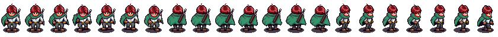

# Verdant
### Synposis
A personal project where I am developing a game using c# and react as the fullstack archicture. I have plans to use the godot for the game engine once I have studied it.
### Genre and Description
A fantasy RPG game that is based on a tabletop game that I have personally designed in the past as as play-by-post.
### Logs
#### 17.06.2026
- Set up a moving player sprite in the primary scene.
  - The assets are borrowed from Michael Games: https://michaelgames.itch.io/2d-action-adventure-rpg-assets

- Set up simple idle and walking animations for the player.
#### 19.06.2026
- Implemented finite state machine pattern for the player.
  - added idle and walking states.
#### 21.06.2026
- Tile Maps and Terrain
  - Added camerabody to the player
  - Adjusted the direction logic
#### 26.06.2026
- Reorganized the godot project structure.
- Added attack animation and shadow to the player
  - Added attack audio clip

#### 27.06.2026
- Added HitBoxes for Placeholder Plants and "HurtBox" for Player

     
